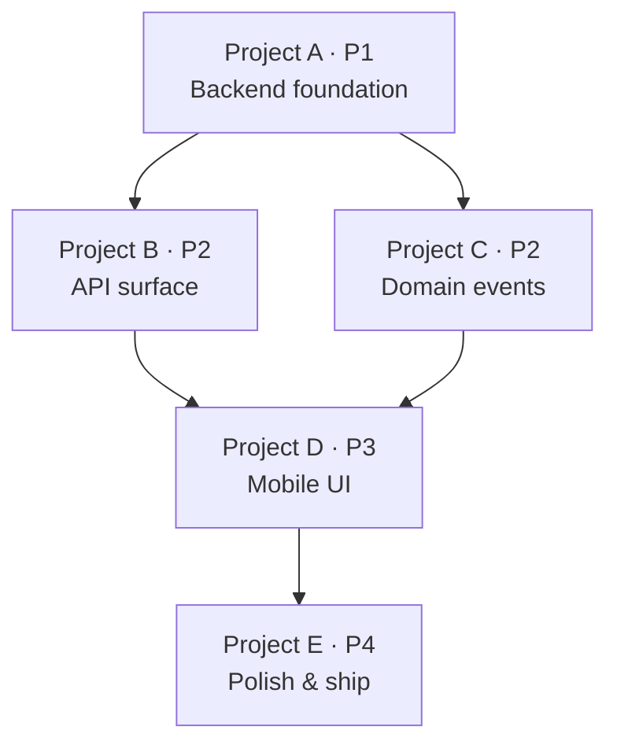

# Phase 2: Plan

Break a design document into Linear projects and implementable issues. Favor fewer, bigger issues over many small ones.

## Input

Parse `$ARGUMENTS`:
- First word: **app name** (golf, portfolio, hive)
- Optional second arg: **initiative path** (e.g., `docs/planning/round-join-codes`)

If no initiative path given, list available initiatives at `docs/planning/` (active projects only — never `docs/archive/`) and ask.

## Steps

### 1. Load Context

1. Read `.claude/planner.local.md` for app config
2. Read the design document at `<initiative-path>/design.md`
3. Read `ddd.md` and `testing.md` from the marketplace pattern docs (resolve via the context-patterns skill: `${CLAUDE_PLUGIN_ROOT}/../../references/patterns/`) — the issue breakdown must align with DDD domain boundaries
4. Check existing Linear projects for this app to avoid duplicates

### 2. Break Into Projects

Analyze the design document and propose a project breakdown:

- Each project should represent a **coherent deliverable** that can be shipped independently
- Projects should follow domain boundaries where possible
- Favor fewer projects — if the feature can be one project, make it one project

For each project, define:
- **Name** — clear, outcome-oriented
- **Description** — what it delivers, which part of the design it covers
- **Priority** — Urgent (1), High (2), Medium (3), Low (4)
- **Dependencies** — which projects must come first

**Present to the user as a Mermaid diagram, not a bulleted text list** (mock-first decisions rule — visual beats prose for any multi-option or dependency-heavy choice). Render it inline in the message:

````

````

If there are more than 3 projects OR the dependencies are non-linear, also generate an HTML file with the diagram + project descriptions and offer the "open locally / tunnel / both / skip" review prompt (see `design` skill's mock-first decision section).

Wait for user approval of the diagram before creating project files.

### 3. Break Into Issues

For each approved project, create issues:

- **Favor bigger, merged issues** over many tiny ones. If two things are always done together, make them one issue.
- Each issue must be implementable in one build session
- Include specific testing checklists in each issue (API routes to hit, expected results, playwright steps)

For each issue, define:
- **Title** — actionable verb phrase
- **Description** — problem, expected behavior, acceptance criteria
- **Priority** — inherited from project unless overridden
- **Estimate** — story points (1, 2, 3, 5, 8)
- **Testing Checklist** — specific curl commands, playwright steps, unit test expectations
- **Labels** — feature, bug, refactor, etc.

### 4. Save Local Files

Create the directory structure:

```
docs/planning/<initiative>/
├── design.md                    # Already exists from research phase
├── <project-name>/
│   ├── README.md                # Project overview, goals, dependencies
│   └── issues/
│       ├── <TEAM-NNN>.md        # Issue spec
│       └── <TEAM-NNN>-plan.md   # Implementation plan (created later by build phase)
```

Issue file format:

```markdown
---
linear_id: GOLF-123
title: Issue title
priority: high
estimate: 3
labels: [feature]
---

## Problem
What needs to change and why.

## Expected Behavior
What the implementation should do.

## Acceptance Criteria
- [ ] Criterion 1
- [ ] Criterion 2

## Testing Checklist
- [ ] `curl -s "$API_URL/api/v1/rounds" -H "$AUTH" | jq .rounds[0].selectedHoles` returns non-empty array
- [ ] Playwright: navigate to /admin/rounds, verify scorecard shows correct holes
- [ ] `turbo test --filter='@bokendell/golf-domains' -- --run round.service` passes

## Files to Touch
- `packages/golf/domains/src/packages/rounds/application/round.service.ts`
- `apps/golf/api/src/packages/rounds/rounds.trpc.router.ts`
```

### 5. Sync to Linear

Load Linear MCP tools via ToolSearch (`+linear`).

For each project:
1. Check if a Linear project with this name already exists for the team
2. If exists: update description, priority
3. If not: create new project under the app's Linear initiative
4. Cross-link (docs contract): set the FIRST line of the Linear project description to the
   GitHub link of the planning folder
   (`https://github.com/<org>/<repo>/tree/main/docs/planning/<initiative>`), and write the
   Linear project URL into `docs/planning/<initiative>/README.md` frontmatter as `linear:`.
   Scaffold the README from the dev:docs skill's `templates/planning-readme.md` if missing.

For each issue:
1. Check if a Linear issue with matching `linear_id` exists
2. If exists: update title, description, priority, estimate, labels
3. If not: create new issue in the project
4. Update the local markdown `linear_id` frontmatter with the created ID

Report: "Synced X projects and Y issues to Linear."

### 6. Handoff

Offer: "Plan synced. Run `/dev build <LINEAR-ID>` on any issue to start building."

## Issue Template

Reference: [issue-template.md](templates/issue-template.md)

## Rules

- ALWAYS read the design document before breaking down. Don't guess.
- ALWAYS include testing checklists in issues. The build phase relies on these.
- FAVOR bigger issues. If two things change the same file, merge them into one issue.
- NEVER create issues without a testing checklist.
- SYNC is idempotent — running plan twice updates rather than duplicates.
- Issue IDs use the Linear team key (GOLF-NNN, PORT-NNN, AGENTS-NNN).
