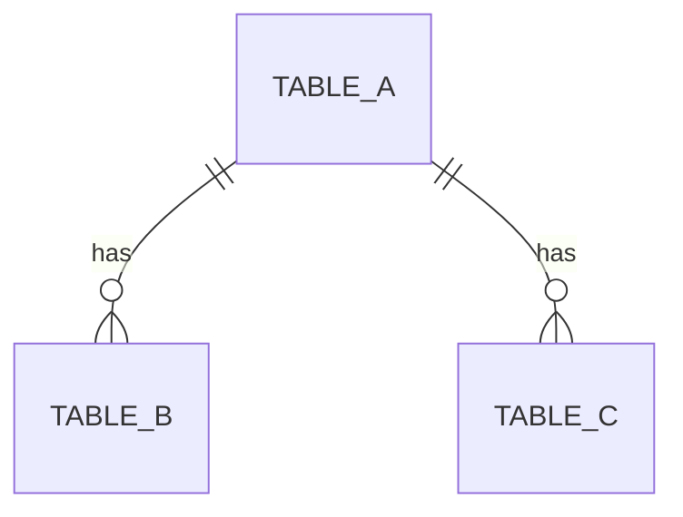
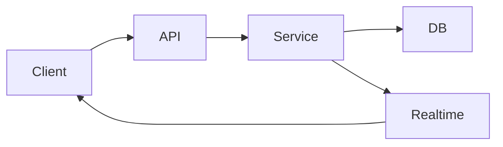
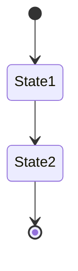
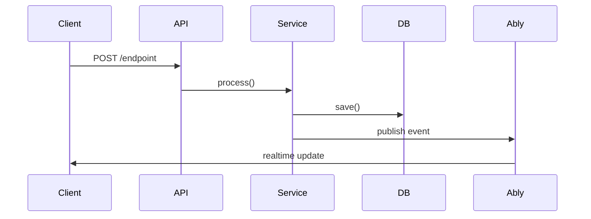

# {Feature Name} — Design Document

## Problem Statement
What problem does this solve? Who has this problem? Why does it matter?

## Solution Overview
High-level description of the approach. 2-3 sentences max.

## User Stories
- As a [role], I want [thing], so that [reason]
- As a [role], I want [thing], so that [reason]

## Success Criteria
- [ ] Criterion 1 (measurable)
- [ ] Criterion 2 (measurable)

## Database Design

### New Tables
| Table | Purpose | Key Columns |
|-------|---------|-------------|

### Modified Tables
| Table | Change | Migration Notes |
|-------|--------|-----------------|

### Entity Relationships

Include a Mermaid ERD when adding or modifying 2+ tables:

## Architecture

### Domain Structure
Which domains are affected? New domains needed?

### Data Flow

Include a Mermaid flowchart showing how data moves through the system. This is required whenever the feature involves more than one service or domain:

### State Machine

Include a Mermaid state diagram if the feature has lifecycle states (round status, order status, etc.):

### Service Boundaries
What services need to be created or modified?

## API Design

### New Endpoints
| Method | Path | Auth | Description |
|--------|------|------|-------------|

### Request/Response Schemas
Show Zod schemas or TypeScript types for new endpoints.

### API Sequence

Include a Mermaid sequence diagram when a request involves 3+ systems (e.g., mobile → API → Inngest → Ably):

## UX/UI Design
Screen descriptions, interaction flows, component hierarchy.
Reference ui-ux-pro-max outputs if visual mockups were created.
Save the HTML showcase to `design-showcase.html` alongside this doc.

## Testing Strategy

### Unit Tests
What business logic needs unit tests?

### Integration Tests
What DB operations need integration tests?

### E2E Tests
What user flows need E2E coverage?

### Performance Tests
What endpoints need smoke tests?

## Out of Scope
What is explicitly NOT included in this feature?

## Open Questions
Unresolved decisions that need input.

---

## Diagram Guidelines

Include Mermaid diagrams in this document when:
- **ERD**: Feature adds or modifies 2+ database tables
- **Data flow**: Feature involves more than one service or domain
- **State machine**: Feature has lifecycle states or status transitions
- **Sequence**: A request touches 3+ systems (client, API, background job, realtime)
- **Component tree**: UI feature has 3+ levels of nesting

Skip diagrams when:
- Simple CRUD with one table and one endpoint
- Bug fix that doesn't change architecture
- Feature is purely cosmetic (use the HTML showcase instead)

Diagrams render natively on GitHub, VS Code, and Obsidian. Keep them simple — if a diagram has more than 15 nodes, split it into multiple diagrams.
