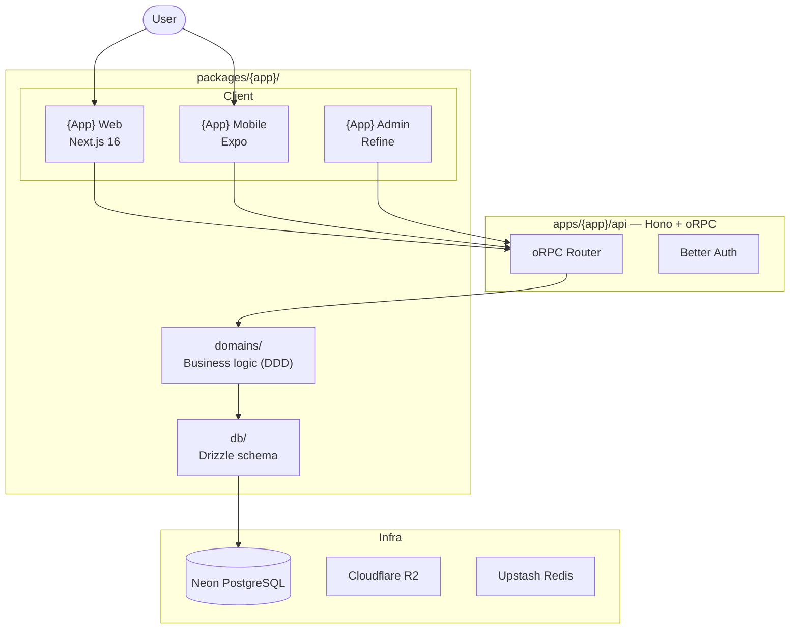
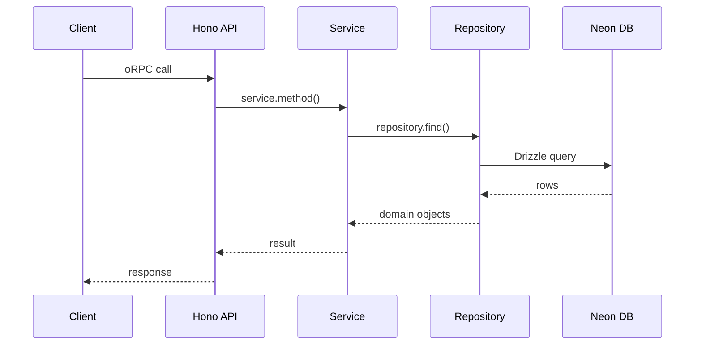

> Generated by: `planner:research` skill
> Lives at: `docs/apps/{app}/architecture.md`
> Mermaid diagrams: use the `mermaid-diagram-specialist` skill

# {App Name} — Architecture

## System overview

## Components

### {Component name}
- **What**: {what it does}
- **Where**: `{path}`
- **Responsibilities**: {list}

## Data flow

## Infrastructure
| Component | Technology | Notes |
|-----------|-----------|-------|
| Database | Neon Serverless PostgreSQL | HTTP driver, no WebSockets |
| Auth | Better Auth | Magic link / OAuth |
| File storage | Cloudflare R2 | |
| Hosting | Vercel | Serverless functions |
| {Other} | {Tech} | {Notes} |

## External dependencies
- {Service}: {why used, what for}

## Key architectural decisions

### Decision: {Title}
**Context**: {what situation prompted this decision}
**Decision**: {what was decided}
**Rationale**: {why}
**Trade-offs**: {what we gave up}
