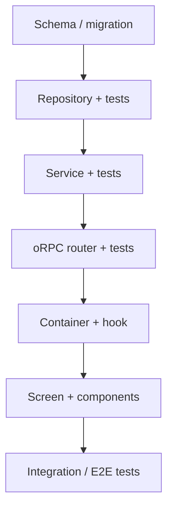

---
linear_id:
generated_at:
generated_by: draft-approach
status: draft            # draft | locked | shipped — draft-approach flips to locked only with zero open questions
links:
  pr:
---

> Generated by: `draft-approach`. This file is the branch's state: any session, local or cloud, reads it to know where the work stands.
> Mermaid diagrams: use the `mermaid-diagram-specialist` skill

# Plan: {TEAM-ID} — {Title}

## Pre-implementation checklist
- [ ] Read issue spec: [{TEAM-ID}.md](./{TEAM-ID}.md)
- [ ] Read: {key architecture docs}
- [ ] Run: `pnpm install --frozen-lockfile`

## Open questions
- [ ] {question — the plan does not lock while any remain}

## Technical notes (with receipts)
[One named approach. Every claim about existing code names the file/function and states what was verified — "verified: both calls present", "verified by grep of callers". A superseded approach is one line naming what it replaces.]

## Keep in mind — accepted risks, out of scope
- {risk accepted, and why}
- Out of scope: {what this deliberately does not do}

## Size (informational — the user decides any split)

## Implementation sequence

## Reference files
- `{path}` — {why relevant}

## Implementation steps

### 1. {Step name}
- [ ] {Task}
- [ ] {Task}

### 2. {Step name}
- [ ] {Task}

### 3. Tests
- [ ] Unit: {what to test}
- [ ] Integration: {what to test}

## Test plan
- [ ] {Specific test scenario}
- [ ] Error case: {scenario}

## Verification
- [ ] `pnpm test`
- [ ] `TEST_DB=true pnpm test` (if DB changes)
- [ ] `pnpm check-types`
- [ ] `pnpm check`
- [ ] Manual smoke test: {what to verify}

## Deviations
[Changes to the locked plan, with reasons. Surfaces in the PR body.]

## Review notes
[Level run · findings addressed · findings declined with reasons]

## QA map
[`map-paths` output — targets with reach/expect/covered_by; `exercise-paths` marks ✓ ✗ →]

## Gate
- [ ] local gate green (`dev:ci-local` / repo `verification`)
- [ ] review clean (`review-change`, no open findings above nit)
- [ ] qa done (`exercise-paths`: every target ✓, device items confirmed, or gap accepted)
- [ ] docs (MAP.md ownership honoured; distill if a planning project closes)

Gate green → `open-pr --ready` → CI → merge, each on an explicit ask. No announcement step.
