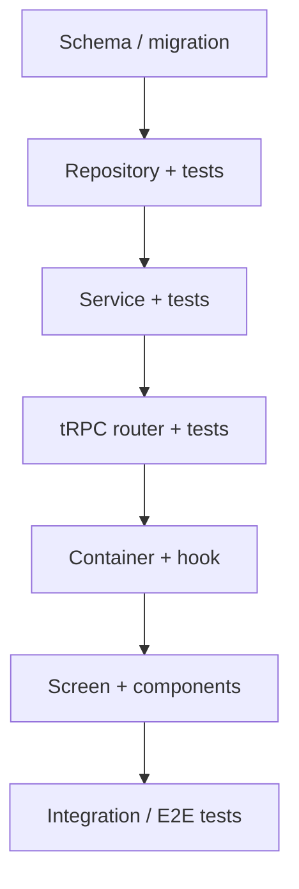

---
linear_id:
generated_at:
generated_by: planner:feature
---

> Generated by: `planner:feature` or `planner:implement` skill
> Mermaid diagrams: use the `mermaid-diagram-specialist` skill

# Plan: {TEAM-ID} — {Title}

## Pre-implementation checklist
- [ ] Read issue spec: [{TEAM-ID}.md](./{TEAM-ID}.md)
- [ ] Read: {key architecture docs}
- [ ] Run: `pnpm install --frozen-lockfile`

## Architecture context
[Summary of relevant existing code — which service, repository, routes are involved]

## Implementation sequence

## Reference files
- `{path}` — {why relevant}

## Implementation steps

### 1. {Step name}
- [ ] {Task}
- [ ] {Task}

### 2. {Step name}
- [ ] {Task}

### 3. Tests
- [ ] Unit: {what to test}
- [ ] Integration: {what to test}

## Test plan
- [ ] {Specific test scenario}
- [ ] Error case: {scenario}

## Verification
- [ ] `pnpm test`
- [ ] `TEST_DB=true pnpm test` (if DB changes)
- [ ] `pnpm check-types`
- [ ] `pnpm check`
- [ ] Manual smoke test: {what to verify}
